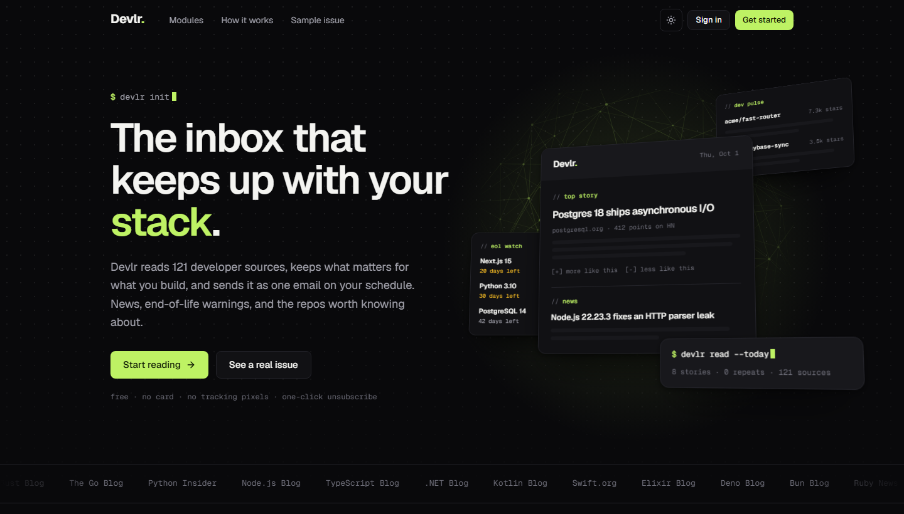
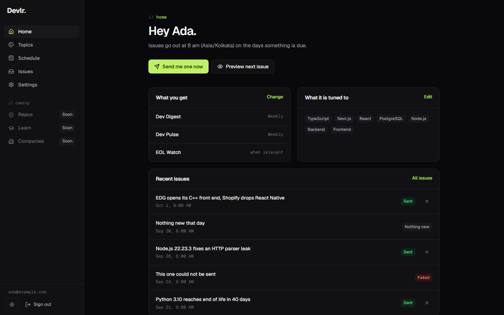
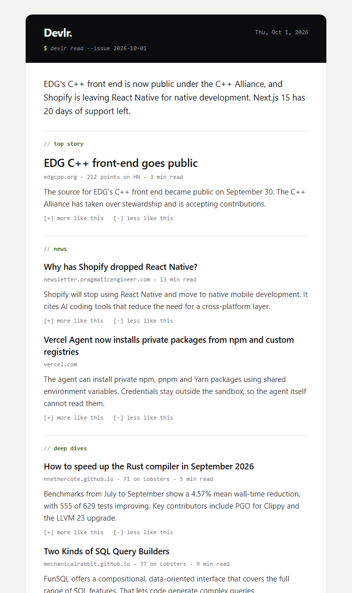

# Devlr.

**The developer inbox.** Devlr reads 121 developer sources, keeps what matters for the stack you
actually use, and sends it as one email on your schedule: news and deep dives, warnings before
a version you run reaches end of life, and the new repositories worth knowing about.



The whole thing runs on free tiers.

## What it does

| Module | Status | |
|---|---|---|
| **Dev Digest** | Built | News, releases and deep dives ranked for your stack. One item per story, even when five outlets cover it, and never the same story twice. |
| **EOL Watch** | Built | A heads-up at 90, 30 and 7 days before a version in your stack stops getting fixes. Dates come from the vendors, via endoflife.date. |
| **Dev Pulse** | Built | New repositories that picked up stars fast, in the languages you write. |
| **Feedback** | Built | Every story has a "more like this" and a "less like this" link. Use them and the next issue shifts. |
| **Archive and feed** | Built | Every issue has a web page, and every account gets a private Atom feed. |
| **Repo Guard** | Planned | Connect GitHub, pick repos, get told when a dependency is vulnerable, hijacked or deprecated, with the command that fixes it. |
| **Learn** | Planned | A system design question at your level, with a worked answer. |
| **Company Radar** | Planned | What the companies you follow shipped, wrote and open-sourced. |
| **Release Radar** | Planned | Release notes for your dependencies, breaking changes first. |

Modules have their own cadence, but everything due on the same day arrives as one email. If
there is nothing new, nothing is sent.

| The dashboard | The email |
|---|---|
|  |  |

## Try it in two minutes

No account or database needed for either of these.

```bash
npm install
npm run dev
```

Open <http://localhost:3000/demo>: every screen, with made-up data.

To see a real issue built from today's sources:

```bash
cp .env.example .env.local     # add a GROQ_API_KEY for model-written copy, or skip it
npm run email:preview
```

That runs the real fetchers, ranking, summariser and editor, and writes `.preview/issue.html`.

Full setup, with sign-in and sending, is in [SETUP.md](SETUP.md).

## How it works

```
  121 sources                         every 2 hours
  RSS, Hacker News, Lobsters, DEV  ──────────────────►  ingest
                                                           │  canonical URL, tags, popularity
                                                           ▼
                                                      content pool  (Postgres + pgvector)
                                                           │
                              once per article             ▼
                              ───────────────────────►  enrich
                                                           │  embed, cluster into stories,
                                                           │  extract text, summarise
                                                           ▼
  every 30 minutes                                    ready to read
  who is due, in their timezone?  ───►  scheduler          │
                                           │               │
                                           ▼               ▼
                                        compose  ◄──  rank for this reader
                                           │          (relevance, popularity, recency,
                                           │           feedback, variety)
                                           ▼
                                        editor   subject, preheader, intro  (LangGraph)
                                           │     write -> review -> rewrite -> template
                                           ▼
                                         send    one email, plain text included
```

Four decisions carry most of the weight.

**Generate once, compose per reader.** Every article is embedded, clustered and summarised
exactly once, and each reader's issue is assembled from that shared pool. The only model call
made per reader is three short lines of copy. Cost grows with the number of articles, not the
number of readers, which is what makes a free tier enough.

**Facts come from sources, not from the model.** A model writes the summary from the article's
extracted text; it does not decide what happened. Before anything is sent, a reviewer that is
plain code checks the draft: every number in the subject line and intro has to appear in the
source material, and the subject has to be about something in the issue. A draft that fails is
rewritten once, then replaced by a template.

**Style is enforced in code.** No em dashes, no exclamation marks, no stock phrases, no
sentences that end in ", enabling X". A prompt can ask for that. [`lib/ai/style.ts`](lib/ai/style.ts)
is what guarantees it, and it has its own test suite.

**Scheduling is a poll, not a chain.** A cron works out who is due in their own timezone and
fans out. Nothing is queued for the future, so a missed tick heals itself, and each send claims
a unique key in the database before doing any work, so a retry can never produce a second email.

## Stack

| | | Free-tier limit that matters |
|---|---|---|
| App | Next.js 16, React 19, Tailwind 4 | |
| Database, auth | Supabase (Postgres, pgvector, row level security) | 500 MB |
| Background jobs | Inngest | about 100k runs a month |
| Agents | LangGraph.js | |
| Models | Groq (`gpt-oss`), Gemini Flash-Lite | 200k tokens a day per Groq model |
| Embeddings | Gemini | |
| Email | Gmail SMTP, React Email templates | about 500 recipients a day |
| Hosting | Vercel | |

Every limit is designed around rather than hoped away: content is pruned after 60 days, model
calls are budgeted per provider per day in Postgres, and the router falls back across providers
and then to templates, so an exhausted quota degrades the writing and never stops a send.

## Project layout

```
app/                  pages and API routes
  app/                the signed-in area (home, topics, schedule, issues, settings)
  demo/               the same screens with mock data, development only
  api/inngest/        where background jobs are served from
components/           UI, including the 3D hero (components/landing)
lib/
  ai/                 model router, style guard, embeddings
  sources/            the source registry and fetchers
  content/            ingest, enrich, rank
  modules/            digest, Dev Pulse, EOL Watch
  delivery/           schedule, ledger, composer, editor
  email/              the issue template
  inngest/            job definitions
  platform/           the delivery platform (see docs/DESIGN.md)
supabase/migrations/  the schema
tests/                247 tests
```

## Tests

```bash
npm test
```

247 tests, no services required. The migrations are tested by running them: the suite starts
Postgres in-process (PGlite, with pgvector), applies the real files, and checks that the signup
trigger fires, that every table has row level security, that one user cannot read or write
another's rows, and that each SQL function returns what the code expects.

`node scripts/check-responsive.mjs` drives a real browser over every screen at four widths and
fails if any text ends up outside the viewport.

## More

- [SETUP.md](SETUP.md): environment variables, first run, deployment
- [docs/DEVLR_PLAN.md](docs/DEVLR_PLAN.md): the product plan and roadmap
- [docs/DESIGN.md](docs/DESIGN.md): the transactional email platform that lives in this repo
  (a Postgres-backed queue with leases, backoff and provider failover)
